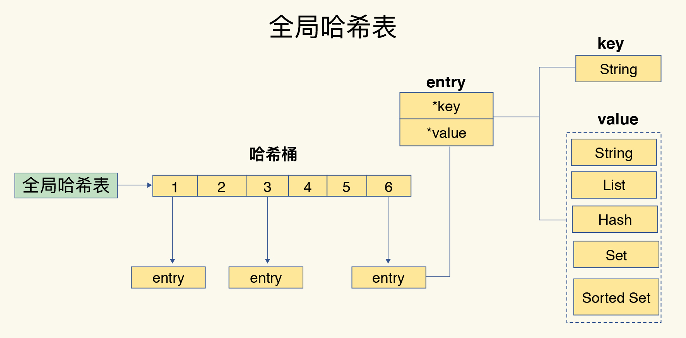

# Redis

## 键值数据库基本架构

对于键值数据库而言，基本的数据模型是 key-value 模型。不同键值数据库支持的 key 类型一般差异不大，而 value 类型则则有较大差别。Memcached 支持的 value 类型仅为 String 类型，而 Redis 支持的 value 类型包括了 String、哈希表、列表、集合等。

一个键值数据库包括了**访问框架**、**索引模块**、 **操作模块**和**存储模块**四部分。

内存键值数据库一般采用哈希表作为索引，内存的随机访问特性可以很好地与哈希表 $O(1)$ 的操作复杂度相匹配。

从简单的 SimpleKV 演进到 Redis，有以下几个重要变化：

- Redis 主要通过网络框架进行访问，优秀的 IO 模型是 Redis 高性能的基础。
- Redis 数据模型的 value 类型很丰富，因此也带来了更多的操作接口。
- Redis 的持久化支持两种模式：日志（AOF）和快照（RDB）。
- Redis 支持高可用集群和高可扩展集群。

## 底层数据结构

Redis 的快速得益于它是内存数据库，还有它的数据结构，高效的数据结构是 Redis 快速处理数据的基础。

底层数据结构一共有6种，分别是简单动态字符串、双向链表、压缩链表、哈希表、跳表和整数数组。

全局哈希表用来保存所有键值对，哈希桶中的元素保存的是指向具体值的指针。

哈希计算的时间复杂度为 $O(1)$ ，所以无论数据量有多大，速度都应该很快，但是有时候操作忽然变慢了，可能是**哈希冲突**问题或者是 **rehash** 带来的操作阻塞。

为了是 rehash 操作更高效，Redis 默认使用了两个**全局哈希表**，默认使用哈希表1，此时哈希表2没有被分配空间。随着数据逐步增多，Redis 开始执行 rehash：

1. 给哈希表2分配更大的空间，例如是当前哈希表1大小的两倍；
2. 把哈希表1中的数据重新映射并拷贝到哈希表2中；
3. 释放哈希表1的空间。

整个过程涉及大量的数据拷贝，使用**渐进式 rehash**。简单来说就是在第二步拷贝数据时，Redis 仍然正常处理客户端的请求，每处理一个请求时顺带将这个索引上的所有 entries 拷贝到哈希表2中。

## 不同数据结构的操作效率

整数数组和双向链表很常见，特征都是顺序读写，操作复杂度基本都是 $O(n)$，操作效率较低。

压缩列表实际上类似于一个数组，数组中的每一个元素都对应保存一个数据，但是有额外信息，zlbytes（列表长度）、zltail（尾部偏移量）和 zllen（列表中的 entry 个数），所以如果要查找第一个元素和最后一个元素可以直接定位，复杂度为 $O(1)$，而查找其他其他元素的时间复杂度都是 $O(N)$。

跳表在链表的基础上，增加了多级索引，通过索引位置的几个跳转，实现数据的快速定位，算法里讲过，时间复杂度为 $O(n)$，不再赘述。

当一个列表或哈希只包含少量项，且每一项的值都比较小（字符长度或者数值小），就会使用压缩列表来节省空间，内存数据库要尽可能提高内存的利用率。而且基数不大即使时间复杂度大，最后的耗时也不长。

## 高性能IO模型

