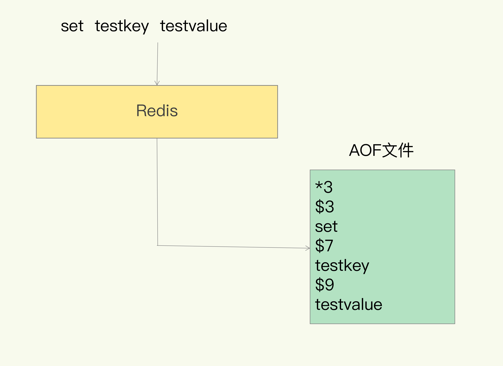

# Redis

## 键值数据库基本架构

对于键值数据库而言，基本的数据模型是 key-value 模型。不同键值数据库支持的 key 类型一般差异不大，而 value 类型则则有较大差别。Memcached 支持的 value 类型仅为 String 类型，而 Redis 支持的 value 类型包括了 String、哈希表、列表、集合等。

一个键值数据库包括了**访问框架**、**索引模块**、 **操作模块**和**存储模块**四部分。

内存键值数据库一般采用哈希表作为索引，内存的随机访问特性可以很好地与哈希表 $O(1)$ 的操作复杂度相匹配。


从简单的 SimpleKV 演进到 Redis，有以下几个重要变化：

- Redis 主要通过网络框架进行访问，优秀的 IO 模型是 Redis 高性能的基础。
- Redis 数据模型的 value 类型很丰富，因此也带来了更多的操作接口。
- Redis 的持久化支持两种模式：日志（AOF）和快照（RDB）。
- Redis 支持高可用集群和高可扩展集群。

## 底层数据结构

Redis 的快速得益于它是内存数据库，还有它的数据结构，高效的数据结构是 Redis 快速处理数据的基础。

底层数据结构一共有6种，分别是简单动态字符串、双向链表、压缩链表、哈希表、跳表和整数数组。


全局哈希表用来保存所有键值对，哈希桶中的元素保存的是指向具体值的指针。


哈希计算的时间复杂度为 $O(1)$ ，所以无论数据量有多大，速度都应该很快，但是有时候操作忽然变慢了，可能是**哈希冲突**问题或者是 **rehash** 带来的操作阻塞。

为了是 rehash 操作更高效，Redis 默认使用了两个**全局哈希表**，默认使用哈希表1，此时哈希表2没有被分配空间。随着数据逐步增多，Redis 开始执行 rehash：

1. 给哈希表2分配更大的空间，例如是当前哈希表1大小的两倍；
2. 把哈希表1中的数据重新映射并拷贝到哈希表2中；
3. 释放哈希表1的空间。

整个过程涉及大量的数据拷贝，使用**渐进式 rehash**。简单来说就是在第二步拷贝数据时，Redis 仍然正常处理客户端的请求，每处理一个请求时顺带将这个索引上的所有 entries 拷贝到哈希表2中。

## 不同数据结构的操作效率

整数数组和双向链表很常见，特征都是顺序读写，操作复杂度基本都是 $O(n)$，操作效率较低。

压缩列表实际上类似于一个数组，数组中的每一个元素都对应保存一个数据，但是有额外信息，zlbytes（列表长度）、zltail（尾部偏移量）和 zllen（列表中的 entry 个数），所以如果要查找第一个元素和最后一个元素可以直接定位，复杂度为 $O(1)$，而查找其他其他元素的时间复杂度都是 $O(N)$。


跳表在链表的基础上，增加了多级索引，通过索引位置的几个跳转，实现数据的快速定位，算法里讲过，时间复杂度为 $O(n)$，不再赘述。

当一个列表或哈希只包含少量项，且每一项的值都比较小（字符长度或者数值小），就会使用压缩列表来节省空间，内存数据库要尽可能提高内存的利用率。而且基数不大即使时间复杂度大，最后的耗时也不长。

## 高性能IO模型

Redis 是单线程，主要是指  **键值对读写** 是由一个线程来完成的，这也是 Redis 对外提供键值存储服务的主要流程。但其他功能比如持久化、异步删除、集群数据同步等，其实是由额外的线程执行的。

多线程编程模式面临共享资源的并发控制问题，系统吞吐率并不会随着线程的增加而线性增加。Redis 采用了**多路复用**机制，使其能在网络 IO 操作中能并发处理大量的客户端请求，实现高吞吐率。

但是单线程的 Redis 不能充分利用 CPU，经常需要在一个具有多核 CPU 的服务器上放置多个 Redis 实例，难以维护。而且单线程处理网络请求的速度可能会跟不上底层网络硬件的速度。

Redis6.0 支持多线程，读写命令仍然是单线程，只是**网络 IO** 变为多线程，Lua 脚本、事务的原子性依然可以得到保证。当有客户端请求和实例建立 Socket 连接时，主线程会创建和客户端的链接，通过轮询方法把 Socket 分配给 IO 线程。

## AOF日志

写后日志，让系统先执行命令，只有命令执行成功，才会被记录到日志中，否则系统会直接向客户端报错。这样避免额外的检查开销，不会阻塞当前的写操作。

AOF（Append Only File）日志以文本形式记录了 Redis 收到的每一条命令。“*3”表示当前命令有三个部分，“$3”表示这部分有3个字节。



AOF 的潜在风险是，如果刚执行完命令，还没来得及记日志就宕机了，这个命令和数据就有丢失的风险。而且 AOF 是在主线程中执行的，如果磁盘压力大导致写盘很慢，后续操作就会阻塞。


系统本身对文件大小有限制，无法保存过大文件；大文件的追加写效率也低；另外文件如果太大，恢复的过程也会变慢。

AOF 重写机制，就是根据数据库的现状创建一个新的 AOF 文件，读取数据库中的键值对，记录其对应的写入命令，这样就能把原先的多次修改操作合并成一条命令。AOF 重写是由后台子进程 bgrewriteaof 来完成的，不会阻塞子线程。

**一个拷贝**，fork 会把主线程的内存拷贝一份给 bgrewriteaof 子进程，主线程就可以不影响主线程，逐一把拷贝的数据写成操作，记入重写日志。

**两处日志**，新来的操作会同时写入到原先的 AOF 日志和重写 AOF 日志的缓冲区，保证日志的齐全。

## RDB日志

RDB 是内存快照，记录某一时刻的数据，做恢复时可以直接把 RDB 文件读入内存。

Redis 提供了两个命令来生成 RDB 文件：

- save：在主线程中执行，会导致阻塞；
- bgsave：创建一个子进程，专门用于写入 RDB 文件。

使用操作系统提供的写时复制技术，一开始子进程共享父进程的内存，如果父进程要进行写操作，这块数据就会被复制一份进行修改。

如果频繁地执行全量快照，会有磁盘写入开销和 fork 操作阻塞的问题，所以有了**混合使用 AOF 日志和内存快照** 的方法，内存快照以一定的频率执行，而在两次快照之间，使用 AOF 日志记录这期间的所有命令操作。

## 主从同步

启动多个 Redis 实例的时候，可以通过 replicaof 命令形成主库和从库的关系。


为了保证主从库的数据一致性，主库会在内存中用专门的 replication buffer，记录 RDB 文件生成后收到的所有写操作。如果从库的数量很多，主库压力会过大，可以采用“主-从-从”级联的方式，让一些从库从其他从库上同步。

repl_backlog_buffer 是一个环形缓冲区，主库会记录自己写到的位置，从库则会记录自己已经读到的位置。即使网络断开之后重连，主库也能把 master_repl_offset 和 slave_repl_offset 之间的差距重新发送给从库。


但是如果缓冲区被写满后，就有可能导致主从库间的数据不一致，所以要设置合理的 repl_backlog_size 参数，这个大小与主库写入速度和网络传输速度有关。

$$缓冲空间大小=主库写入命令速度*操作大小-主从库间网络传输命令速度*操作大小$$

## 哨兵机制

哨兵机制是实现主从库自动切换的关键机制，它有效地解决了主从复制模式下故障转移的问题。哨兵是一个运行在特殊模式下的 Redis 进程，主要负责三个任务：监控、选主和通知。

哨兵会使用 PING 命令检测它自己和主、从库的网络连接情况，用来判断实例的状态。为了避免误判，哨兵通常会以集群模式进行部署，多个哨兵同时判断主库下线 的时候，才会真正下线。


选择主库时，首先根据从库的在线状态和网络连接状态剔除不符合条件的候选，然后根据优先级、复制进度和 ID 号，进行打分。


在设置哨兵集群的时候，只需要配置哨兵监控的主库 IP 和端口，哨兵通过 pub/sub 机制发现其他哨兵。

```bash
sentinel monitor <master-name> <ip> <redis-port> <quorum>
```

除了哨兵机制，我们自己编写的应用程序也可以通过 Redis 进行消息的发布和订阅，只有订阅了同一个频道的应用，才能通过发布的消息进行信息交换。


哨兵可以向主库发送 INFO 命令获取从库列表。客户端也可以从哨兵订阅消息，发布订阅模式很有用，但是一般不能用来作为消息队列，因为消息会堆积在输出缓冲区，导致 redis 速度变慢甚至崩溃，可以使用 List 或者 Streams 来实现消息队列，发布订阅只用来实现一些事件通知。


哨兵通过投票做决策，赞成票数至少要为配置的 quorum 参数，并且要超过半数，成为 Leader 的哨兵会进行选主操作，并通知其他从库和客户端。

不同的哨兵配置要一致，尤其是主管下线的判断值 down-after-milliseconds，否则可能会导致哨兵不能形成共识，导致不能及时切换主库，集群服务不稳定。

## 切片集群

启动多个 Redis 实例组成一个集群，然后按照一定的规则，把收到的数据划分成多份，每一份用一个实例来保存。


Redis Cluster 采用哈希槽来处理数据和实例之间的映射关系，一个切片集群共有16384个哈希槽，其实 CRC16 算法产生的 hash 值有16bit，一共可以产生$2^{16}=65536$个值，但是这样太浪费空间了，实际上根本不会有那么多节点。

Redis 实例会把自己的哈希槽信息发给和它相连接的其它实例，来完成哈希槽的分配信息和扩散，而自己的哈希槽信息可以通过计算得到，这样每个实例就有所有哈希槽的映射关系了。

在集群中，实例有新增或删除，Redis 需要重新分配哈希槽；为了负载均衡也需要重新分配。

客户端缓存的分配信息可能和最新的分配信息不一致，Redis Cluster 方案提供了一种**重定向机制**，就是客户端给一个实例发送数据库读写操作时，这个实例上没有相应的数据，实例会给客户端发送 MOVED 命令响应结果，客户端会给新实例发送操作命令。


而如果 Slot 数据正在迁移中，会返回 ASKING 命令，并不会更改本地缓存，只会重定向这一次。
