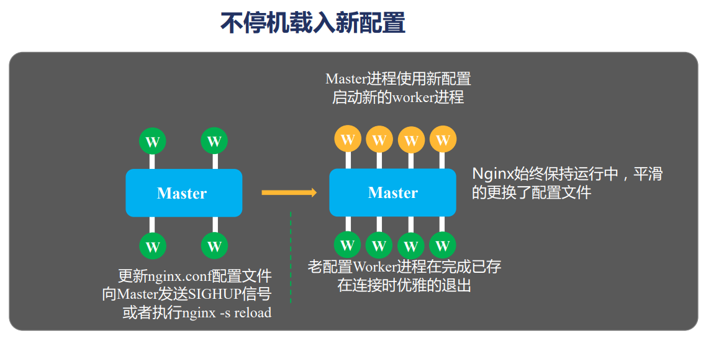
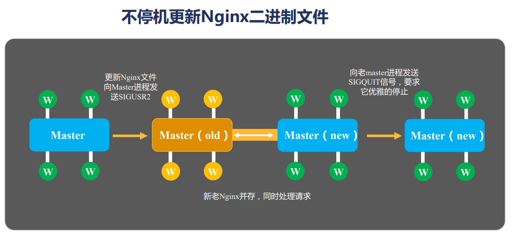

# Nginx

## 使用场景

- 静态资源服务
- 反向代理服务
- API 服务

## 安装过程

源码配置：

目录结构：

vim 拷贝一下，可以语法高亮

cp -r contrib/vim/* ~/.vim/

auto 包含四个子目录 cc用于编译，lib是库，os对操作系统判断，其他所有文件辅助configure脚本判断当前nginx支持那些模块。

CHANGES包含了版本特性

conf是示例文件，默认配置

configure脚本用来生成中间文件，执行编译前的必备动作

contrib目录提供了两个脚本和vim工具

html目录提供了两个html文件，一个50x.html，一个index.html

tree html/

man目录是帮助文件

src目录是源代码

./configure —help 查看帮助

./configure —prex=/home/nginx 指定安装目录

各种with模块和without模块的配置

生成的中间文件放在objs/ 文件夹下

ngx_module.c决定了有哪些模块会被编译进nginx

编译：

最后执行make编译

安装：

首次安装使用make install

模块分类：

## 命令行

kill -USR2 13195

nginx会新起一个进程，平滑地把请求过渡到新的。

kill -WINCH 13195

优雅地退出，老的worker进程没了

老的master进程还在，可以reload重新起来

nginx的发信号命令-s一般都有kill命令对应

kill -HUP对应nginx -s reload

kill -USR1 对应 nginx -s reopen都可以重新生成日志文件

日志切割，可以直接mv掉原先的日志再reopen

在Linux或者Unix系统中，通过rm或者文件管理器删除文件将会从文件系统的目录结构上解除链接(unlink).然而如果文件是被打开的（有一个进程正在使用），那么进程将仍然可以读取该文件，磁盘空间也一直被占用。而我删除的是nginx的log文件删除的时候文件应该正在被使用

## 配置文件

配置文件由指令和指令块构成

gzip压缩可以大幅度减少文本文件大小

autoindex自动索引文件目录结构

$limit_rate 响应速度

log_fromat日志格式，可以命名，可以放很多变量

access_log 日志路径 日志格式;

proxy_set_header保存源请求的信息

减轻上有服务压力可以用反向代理缓存，不去请求直接返回proxy_cache_path

proxy_cache_key

proxy_cache_valid

常用变量：

## 进程模型

## 反向代理

反向代理是 Nginx 最重要的功能，

- stream 四层负载均衡

- HTTP 七层负载均衡

## OpenResty

可以把nginx复制到openresty里做热升级

